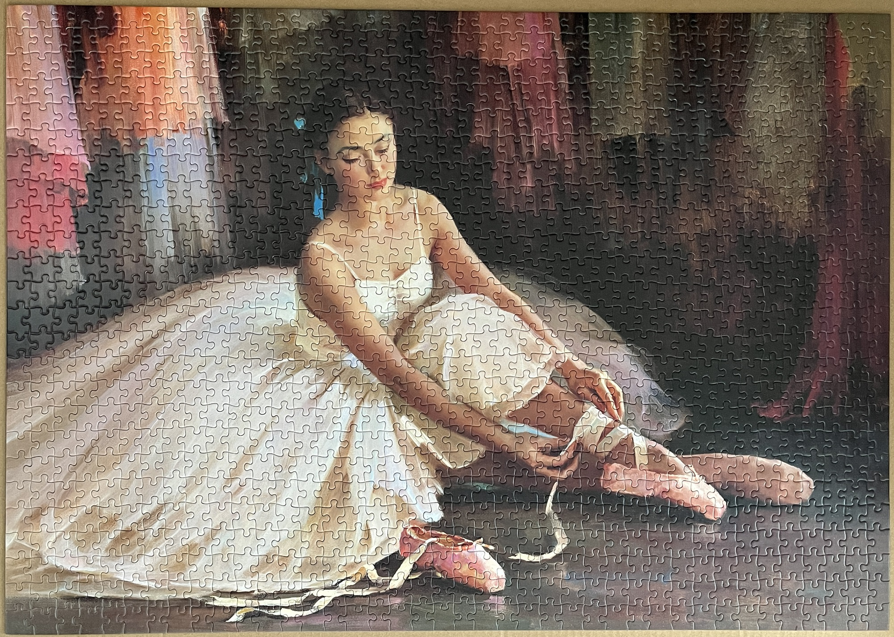
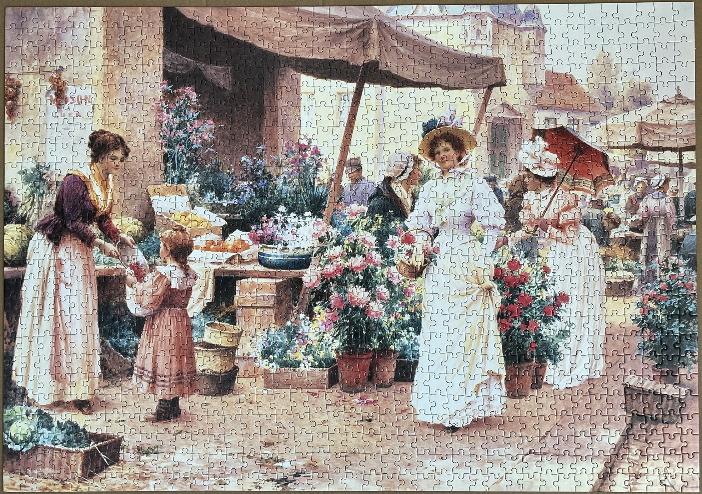
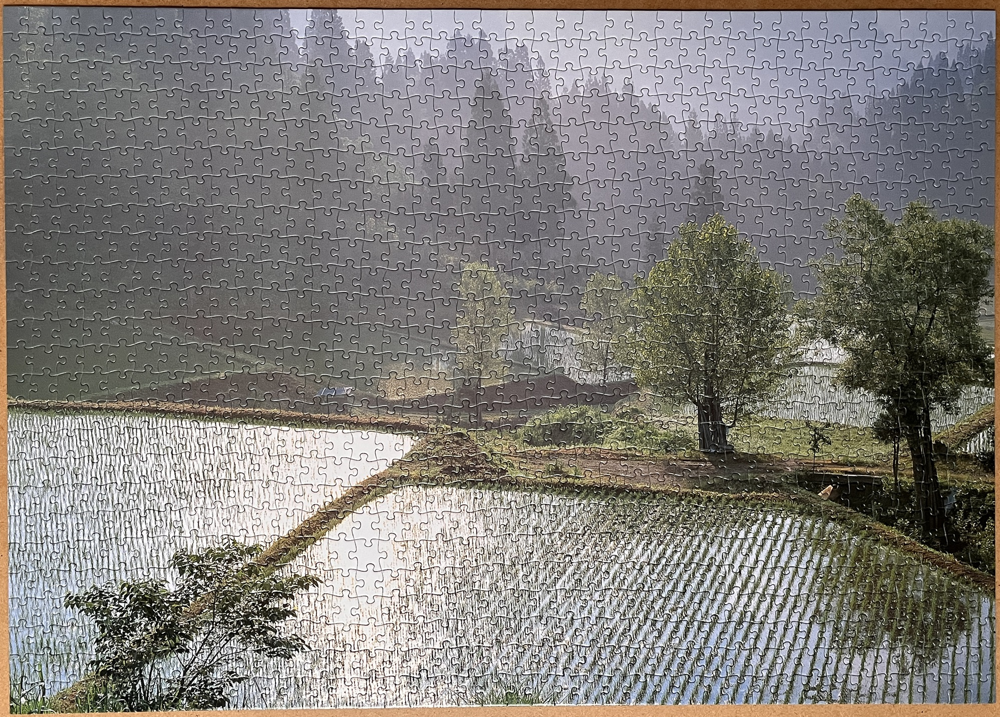
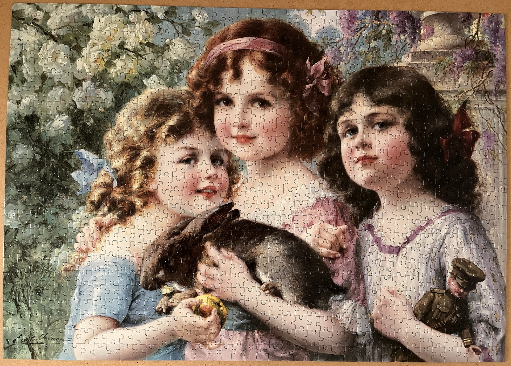
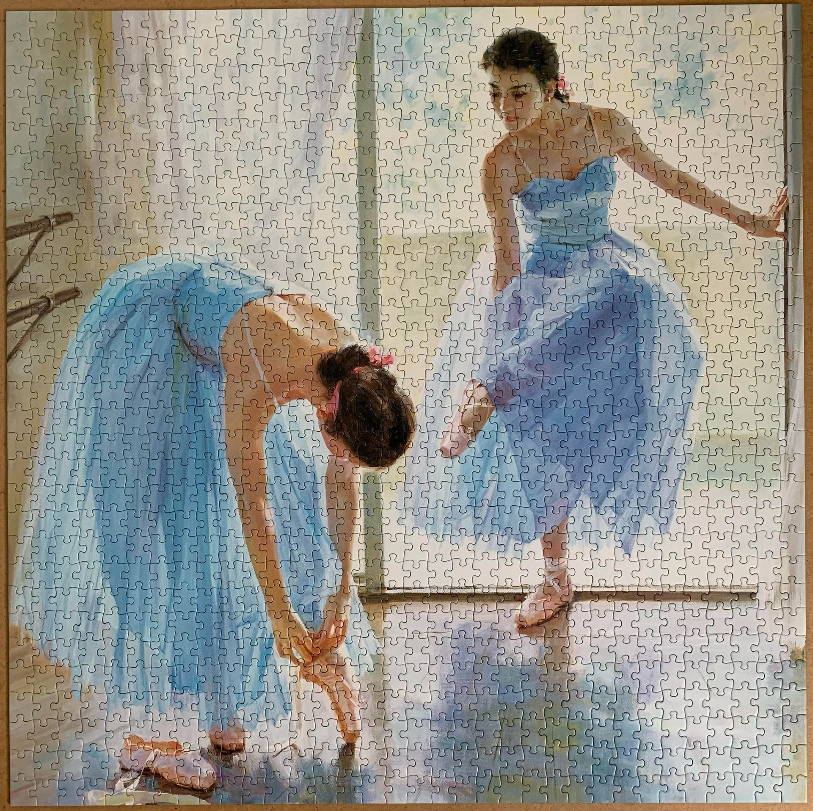
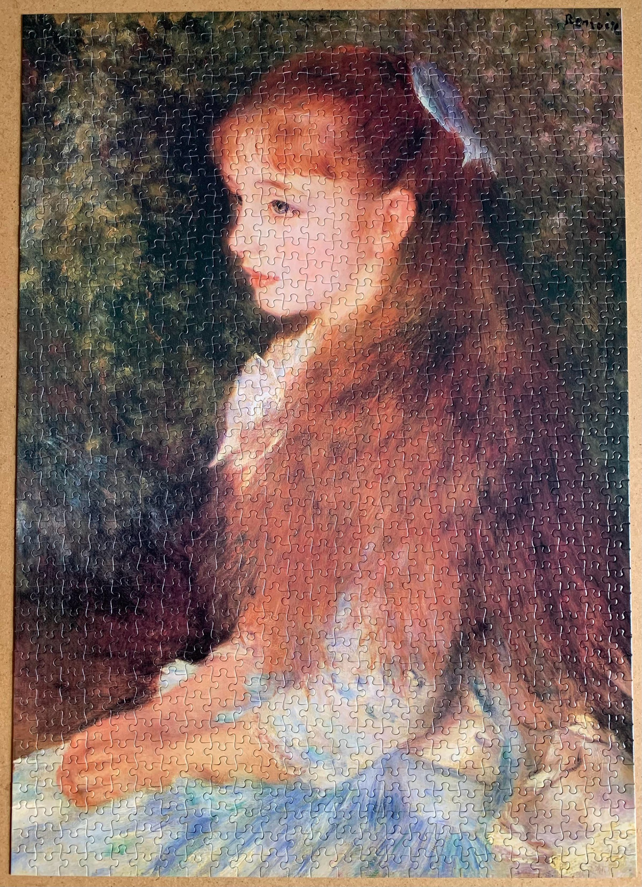

<a href="https://luffm.github.io/Jigsaw-Puzzles/">Jigsaw Puzzles</a>

## Toeshoes (Guan Ze-ju)
2026-02-07 

 1000 pieces

## Flower Market (A.A. Glendening)
2025-11-10 

 1000 pieces

## Matsunoyama Fields
2025-02-20 

 1000 pieces

## The Pet Rabbit (Émile Vernon)
2024-07-24 

 1000 pieces

## Private Rehearsal (Guan Ze-ju)
2022-06-19 

 1000 pieces

## Irene Cahan d'Anvers (Pierre-Auguste Renoir)
2021-10-02 

 1000 pieces

<a href="https://luffm.github.io/Jigsaw-Puzzles/">Jigsaw Puzzles</a>

